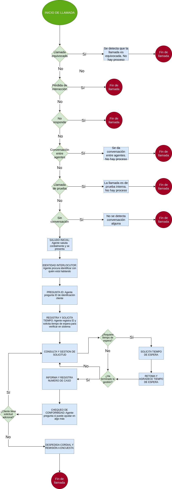
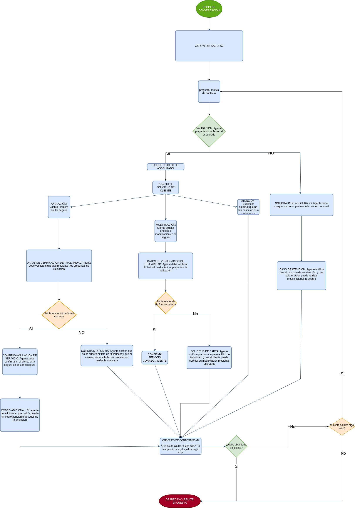
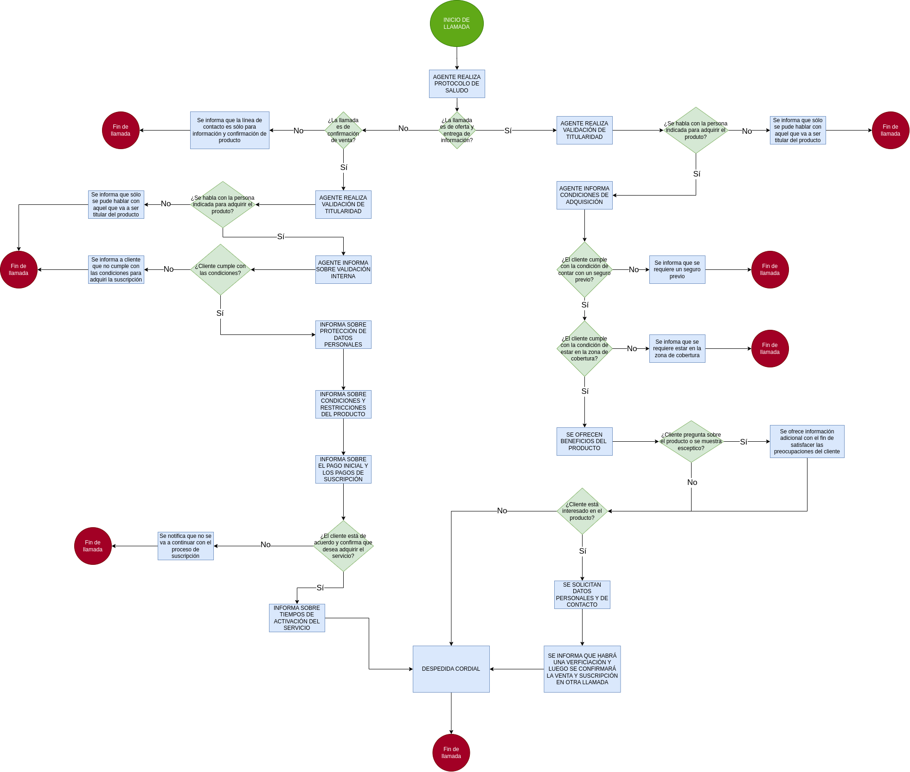

### Objetivo: 
Crear un sistema que identifique y clasifique automáticamente los procesos en las llamadas de interacción entre un agente y un cliente.
  
### Descripción: 
  
#### 1. **Definición de procesos:**

Se definirán 3 procesos base con sus respectivos flujos o grafos. 

##### Proceso 1: Cobranzas



La figura anterior muestra el diagrama de flujo del proceso 1. A continuación se describe el proceso 1:

---
1. **Inicio de Llamada**:
   - La llamada comienza.

2. **Detección de Llamada Equivocada**:
   - Se verifica si es una llamada equivocada.
   - Si es una llamada equivocada, la llamada termina.
   - Si no, se continúa con el proceso.

3. **Pérdida de Interacción**:
   - Se verifica si hay pérdida de interacción.
   - Si hay pérdida de interacción, la llamada termina.
   - Si no, se continúa con el proceso.

4. **No Responde**:
   - Se verifica si el interlocutor no responde.
   - Si no responde, la llamada termina.
   - Si responde, se continúa con el proceso.

5. **Conversación entre Agentes**:
   - Se verifica si la llamada es una conversación entre agentes.
   - Si es una conversación entre agentes, la llamada termina.
   - Si no, se continúa con el proceso.

6. **Llamada de Prueba**:
   - Se verifica si la llamada es una llamada de prueba.
   - Si es una llamada de prueba, la llamada termina.
   - Si no, se continúa con el proceso.

7. **Sin Conversación**:ier
   - Se verifica si no hay conversación.
   - Si no hay conversación, la llamada termina.
   - Si hay conversación, se continúa con el proceso.

8. **Saludo Inicial**:
   - El agente saluda cordialmente y se presenta.

9. **Identidad del Interlocutor**:
   - El agente procura identificar con quién está hablando.

10. **Pregunta de ID**:
    - El agente solicita la identificación del cliente.

11. **Registro y Solicitud de Tiempo**:
    - El agente registra la ID y solicita tiempo para verificar en el sistema.

12. **Consulta y Gestión de Solicitud**:
    - Se realiza la consulta y gestión de la solicitud.
    - El proceso de gestión debe continuar hasta la solución o final de caso
   
13. **Requiere Tiempo de Espera**:
    - Se verifica si se necesita tiempo de espera.
    - Si se necesita, se solicita tiempo de espera y se retoma el proceso cuando el tiempo de espera ha concluido, agradeciendo por la espera.
    - Si no se necesita, se continúa con el proceso.

14. **Informe y Registro de Número de Caso**:
    - El agente informa y registra el número de caso.

15. **Chequeo de Conformidad**:
    - El agente pregunta si puede ayudar en algo más.

16. **Cliente tiene Solicitud Adicional**:
    - Se verifica si el cliente tiene alguna solicitud adicional.
    - Si el cliente tiene alguna solicitud adicional, se retoma el proceso desde la gestión de la solicitud.
    - Si no tiene solicitudes adicionales, se procede a la despedida.

17. **Despedida Cordial y Remisión a Encuesta**:
    - El agente se despide cordialmente y remite al cliente a una encuesta.

18. **Fin de Llamada**:
    - La llamada termina.
----

##### Proceso 2: SAC



La figura anterior muestra el diagrama de flujo del proceso 2. A continuación se describe el proceso 2:

---
1. **Inicio de Conversación**:
   - Comienza la conversación.

2. **Guion de Saludo**:
   - El agente sigue un guion de saludo al iniciar la interacción.

3. **Pregunta Motivo de Contacto**:
   - El agente pregunta el motivo del contacto.

4. **Validación del Asegurado**:
   - Agente pregunta si está hablando con el asegurado
   - Si habla con él, se procede a solicitar el ID del asegurado.
   - Si no habla con él, se procede a solicitar el ID del asegurado y se notifica que el caso queda en estado "CASO ATENCIÓN", y que sólo el asegurado puede continuar con el trámite. Luego, se procede directamente al "Chequeo de conformidad"

5. **Solicitud de ID del Asegurado**:
   - El agente solicita al cliente la información de identificación.

6. **Consulta según el tipo de solicitud del cliente**:
   - **Anulación**: El cliente desea anular el seguro.
     - El agente verifica la titularidad mediante preguntas de validación.
   - **Modificación**: El cliente desea modificar el seguro.
     - El agente verifica la titularidad mediante preguntas de validación.
   - **Atención especial**: Cualquier solicitud que no consista en anulación o modificación
     - Se trata la solicitud acorde a lo solicitado por el cliente

7. **Verificación de Titularidad**:
   - Se realizan preguntas de verificación de titularidad.

8. **Respuesta del Cliente**:
   - Si el cliente responde de manera correcta:
     - **Anulación**: El agente confirma la anulación del seguro y notifica al cliente que este debe dar por cancelado el seguro.
     - **Modificación**: El agente confirma la modificación del seguro.
   - Si el cliente no responde de manera correcta:
     - El agente notifica que no se superó la verificación y que el cliente debe escribir una carta solicitando la anulación o modificación del seguro.

9. **Confirmación de Servicio**:
   - El agente notifica al cliente que el servicio ha sido confirmado; la anulación o modificación ha sido procesada.
   - En caso de anulación, se informa sobre posibles cobros restantes por el servicio.

10. **Chequeo de Conformidad**:
    - El agente pregunta si puede ayudar en algo más.

11. **Cliente Solicita Algo Más**:
    - Si el cliente tiene solicitudes adicionales, se retoma el proceso de gestión, a la pregunta por motivo de contacto.
    - Si no, se cierra la llamada.

12. **Despedida y Remite a Encuesta**:
    - El agente se despide cordialmente y remite al cliente a una encuesta.

13. **Fin de Llamada**:
    - La llamada concluye.
---

##### Proceso 3: Ventas



La figura anterior muestra el diagrama de flujo del proceso 3. A continuación se describe el proceso 3:

---
Existen dos tipos de llamda: "Proceso de Oferta y Entrega de Información" y "Proceso de Confirmación de Venta".

Si el cliente se comunica con otro propósito, se procede a informar que la línea es sólo de ventas, y se incurre en la Finalización

###### Proceso de Oferta y Entrega de Información
1. **Inicio de la llamada**: La llamada comienza con el agente realizando un protocolo de saludo.
2. **Procedimiento de validación**:
    - El agente pregunta si está hablando con la persona correcta para ofertar el producto.
    - Si no es la persona indicada, se informa al cliente que solo puede recibir información general y la llamada se finaliza.
    - Si es la persona indicada, el agente realiza una validación de titularidad.
3. **Validación de titularidad**:
    - Si la validación no es exitosa, se informa al cliente que no cumple con los requisitos y se finaliza la llamada.
    - Si la validación es exitosa, el agente informa sobre las condiciones de adquisición del producto.
      - Si el cliente no cumple con la condición de poseer un seguro previo, se informa qué se requiere y finaliza la llamda
      - Si el cliente no cumple con la condición de hallarse en la zona de cobertura, se informa qué se requiere y finaliza la llamda
      - Si el cliente cumple con ambas condiciones, se procede con el informa de beneficios
4. **Se ofrecen beneficios del producto**
    - El agente informa sobre los beneficios del producto
    - Si el cliente pregunta o se muestra escéptico sobre el producto, el agente debe satisfacer sus dudas y preocupaciones
5. **Se consulta si el cliente está interesado en la suscripción**
    - Si el cliente no está interesado, se procede con la Finalización
    - Si el cliente está interesado, se procede con la solicitud de datos de contacto
6. **Se solicitan datos de contacto**
    - Agente solicita unos datos finales de contacto para validación interna
7. **Se notifica sobre verificación y validación interna
    - Agente notifica que se hará una verificación adicional de manera interna
    - Agente notifica que pronto se hará la siguiente llamada de Confirmación de venta
    - Se procede a la Finaización
    
###### Proceso de Confirmación de Venta
1. **Verificación de titularidad**:
    - Realiza verificación de titularidad;
    - Si el cliente no es el titular que adquirirá la suscripción, se informa que la afiliación sólo puede ser confirmada por el tiutlar; luego, se procede a la Finalización
2. **Resultados validación interna**:
    - El agente informa sobre los resultados de validación interna:
      - Si el cliente no cumple con los requisitos, se informa, se notifica que la afiliación no puede continuar, y se procede a la Finalización
      - Si el cliente cumple con los requisitos, continúa el proceso de afiliación
3. **Informe sobre protección de datos personales**:
    - El agetne informa sobre la política de protección de datos personales
4. **Informe sobre las condiciones y restricciones de la suscripción**:
    - El agente informa sobre todas las condiciones y restricciones que lleva la suscripción
5. **Informe sobre pago inicial y pagos de suscripción**:
    - El agente informa sobre el pago inicial y las condiciones de los pagos subsecuentes
6. **Confirmación del cliente**:
    - El cliente confirma adquirir la suscripción con un explícito "Sí acepto"
7. **Activación del servicio**:
    - Se informa sobre el tiempo de activación del servicio.
    - Se notifica que se enviará una confirmación al finalizar el proceso.
    - Se procede con la Finalización

###### Finalización
- **Despedida cordial**: El agente realiza una despedida cordial indicando el cierre de la llamada.

---

####  2. Generación de datos:

- Cada estudiante generará 50 llamadas artificiales (utilizando modelos de lenguaje), cada una con un proceso específico y variaciones en el orden de  las interacciones.  La estructura de cada llamada debe ser:
```
agente: mensaje
cliente: mensaje
agente: mensaje
cliente: mensaje
.
.
.
```

- Se combinarán los datos generados por todos los estudiantes en un único dataset.
    
#### 3. Identificación de procesos:

Los estudiantes crearán un proceso o pipeline usando LLMs que identifique los diferentes procesos presentes en las llamadas del dataset.  
    
#### 4. Clasificación de llamadas:

El pipeline deberá clasificar nuevas llamadas según el proceso identificado.  

#### 5. Extracción de información (opcional):

Se podrá extraer información relevante de cada proceso dentro de una llamada (ejemplo:  en un proceso de devolución, extraer el motivo de la devolución).  

#### 6.  Evaluación: 
Es importante definir métricas o score de evaluación tanto para la identificación, como para la clasificación. Las métricas de evaluación pueden ser con base en pruebas sencillas (expresiones regulares, comparaciones, ejemplos hechos a mano), LLM como juez o si disponemos de etiquetado manual. 

#### 7. Visualización (opcional):

Representar el proceso identificado en un formato visual (diagrama, grafo, etc.).  
  
**Evaluación:** Se comparará el desempeño de los modelos en la identificación y clasificación de procesos, tomando como referencia los procesos base definidos inicialmente.  
  
**Herramientas:** Se utilizarán herramientas gratuitas como Google Colab, Hugging Face  y principalmente la API de [Groq](https://console.groq.com/playground).

## Entrega

El trabajo realizado durante la hackathon se entregara principalmente mediante una presentación y un repositorio público con todo el desarrollo. La presentación debe tener:

- Presentación del reto
- Metodología o proceso desarrollado
- Resultados y Discusión (análisis de resultados)
- Conclusiones

  